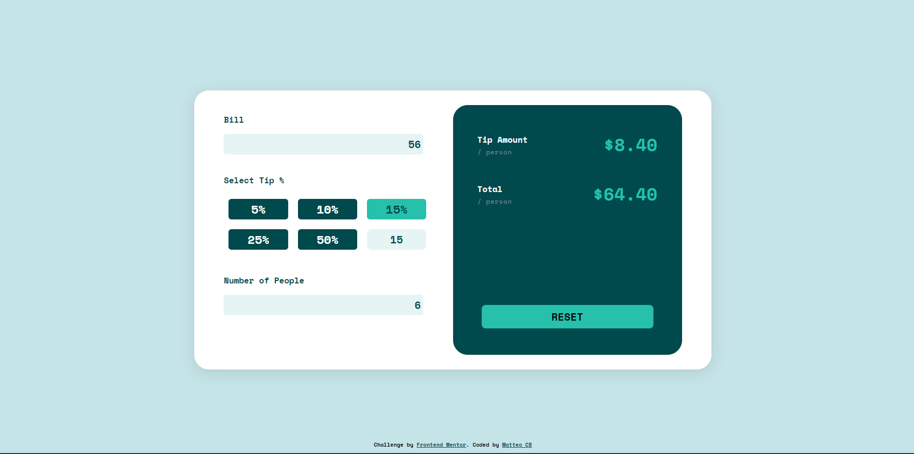

# Tip Calculator

## Description

L'application Tip Calculator vous permet de calculer le montant du pourboire et le total en fonction du montant donné. C'est un outil pratique pour estimer le pourboire approprié lors du paiement d'une note dans un restaurant ou tout autre service nécessitant un pourboire. 

## Fonctionnalités

- Calcul du pourboire : Vous pouvez entrer le montant total de la note et choisir le pourcentage de pourboire à donner. L'application calculera automatiquement le montant du pourboire.

- Calcul du total : En plus du pourboire, l'application calculera également le total à payer en ajoutant le montant du pourboire au montant initial de la note.

## Prérequis

Avant de pouvoir utiliser cette application, assurez-vous d'avoir les éléments suivants :

- Node.js installé sur votre machine
- Un navigateur web compatible

## Guide d'installation

1. Clonez le dépôt de l'application depuis GitHub : `git clone https://github.com/votre-utilisateur/calculator1.git`

2. Accédez au répertoire de l'application : `cd calculator1`

3. Installez les dépendances requises en exécutant la commande suivante : `npm i`

4. Lancez l'application en exécutant la commande : `npm start`

5. Ouvrez votre navigateur et accédez à l'URL suivante : `http://localhost:3000`
